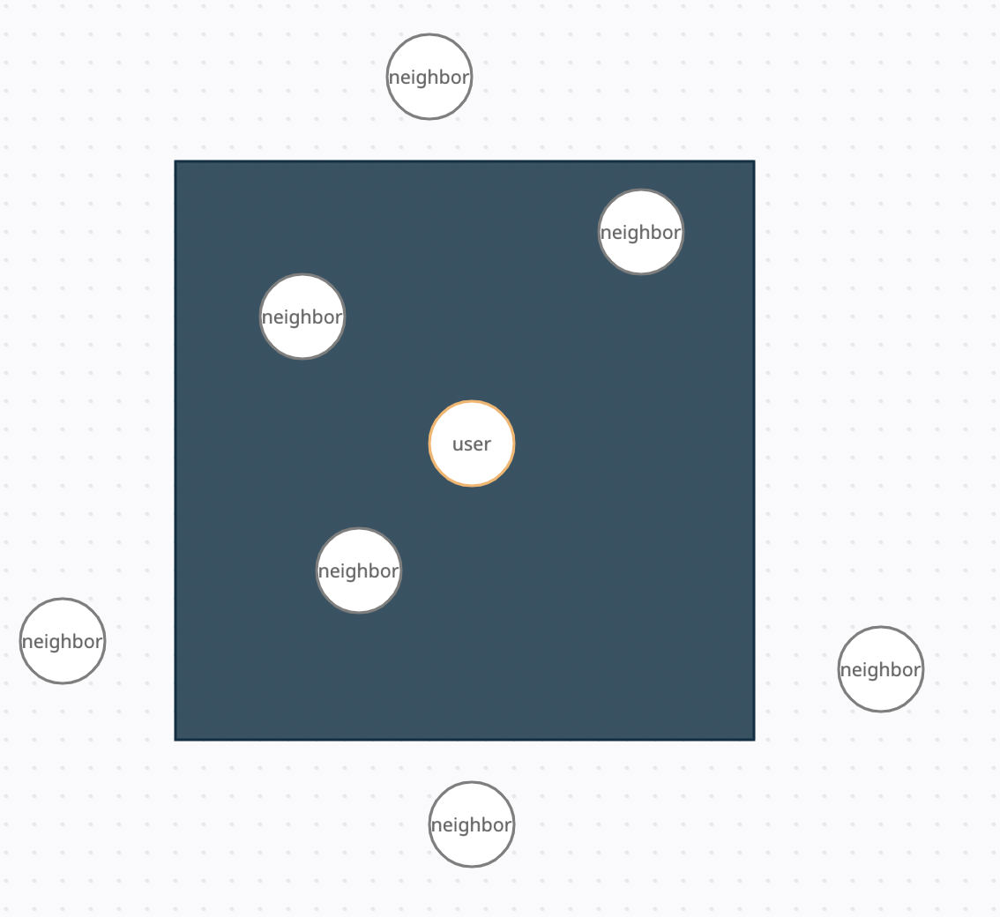
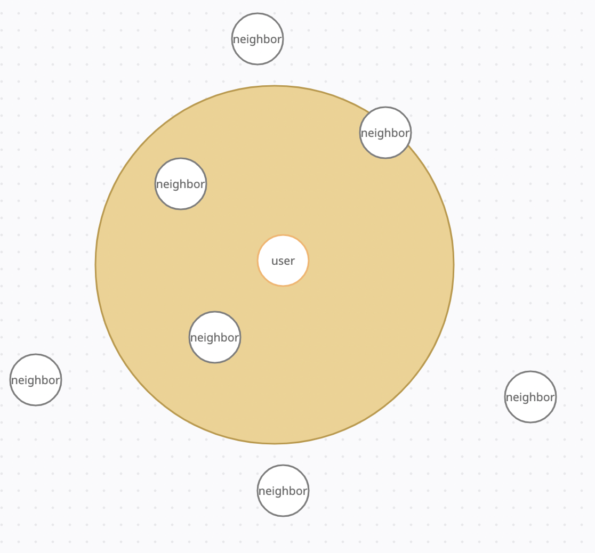

<br/>

Тестовое задание для компании ntechlab - https://ntechlab.com/ru/

## Техническое задание
Напишите REST-сервис для поиска соседей. Основная функция - сервис должен позволить запросить K ближайших соседей пользователя N в радиусе M километров.

У каждого пользователя есть:
 - ID (int64);
 - имя (строка до 128 символов);
 - координаты (числа с плавающей точкой - 2D, на плоскости, сфере или геоиде - на выбор).

Помимо поиска сервис должен позволять создавать пользователей с указанными ID, именами и координатами обеспечивая уникальность ID.

У вас сто миллионов пользователей и один вечер.

## Описание проекта
Решение написано для плоскости координат.

Проект представлен как тестовый стенд возможностей программиста.
В проекте представлено минимальное покрытие тестами.

Основное решение к проекту было найдено и реализовано за приблизительно 5 часов. (см первый коммит)
<br/>
Доп инструменты подключались по мере появления свободного времени.

## Решение
Вначале, чтобы отсечь наибольшее количество пользователей из базы, делается условие на поиск
всех доступных соседей на расстоянии radius от пользователя, тк условие задается через
beetween -> формируется квадрат поиска в котором могут находиться соседи.
```python
stmt = sa.select(
        UserTable, func.sqrt(
            func.pow(UserTable.c.x, 2) + func.pow(UserTable.c.y, 2)
        ).label("hypotenuse")
    ).where(
        sa.and_(
            sa.between(UserTable.c.x, x - radius, x + radius),
            sa.between(UserTable.c.y, y - radius, y + radius),
            UserTable.c.id != user_id
        )
    ).limit(limit)

```
<br/>



<br/>
В этом же запросе к базе я рассчитываю гипотенузу, для каждого пользователя,
ведь гипотенуза является расстоянием пользователя до его соседа.

Далее отсекаются углы у квадрата, и пользователи проходят фильтрацию по гипотенузе.
```python
all_users_in_circle = tuple(filter(lambda user: user.hypotenuse <= radius, users))
all_sorted_users_in_circle = sorted(all_users_in_circle, key=lambda user: user.hypotenuse)
```

Тем самым получая всех близлежайших соседей к пользователю в необходимом радиусе. 
<br/>



## Технологический стек
- aiohttp
- aiohttp-swagger
- aiopg
- alembic
- dynaconf
- marshmallow
- SQLAlchemy (core)

## Тестирование
Запуск тестов
```bash
python -m pytest
```
```bash
python -m pytest --cov-report=html    
```
- aiohttp-pytest
- pytest-cov

## Вспомогательные инструменты
- black
- isort

## swagger
- /api/v1/doc

## dynaconf
```toml
[development.db_config]
DB_HOST = 'localhost'
DB_PORT = 5432
DB_USER = 'admin'
DB_NAME = 'user_search'
DB_PASS = 1234
DB_ENGINE_CONSTANT = "db_engine"
```
